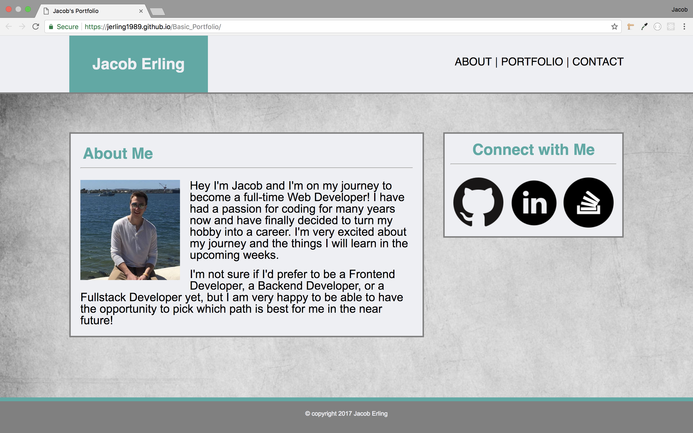
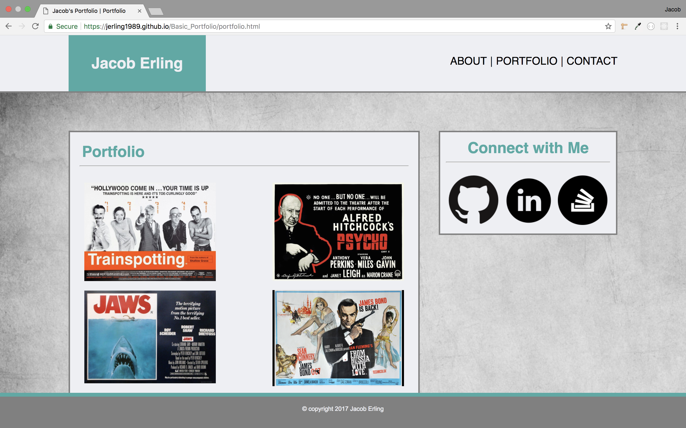
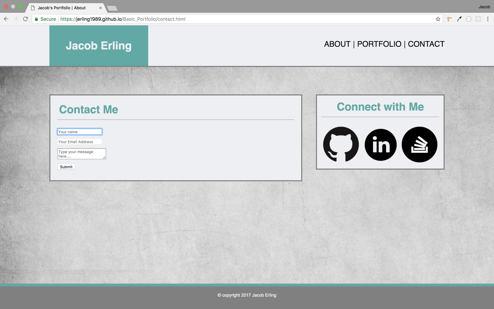

# Basic_Portfolio
This is a very simple portfolio site I made with just HTML and CSS. It was done during a quick exercise at Rutgers to lay out some of the foundations of web design. The website is not mobile responsive, that feature was added to another repository.

---

- The first page the user will land on is the home or "about" page. It has a picture of me along with a description of who I am. It also has links to my GitHub, LinkedIn, and Stack Overflow accounts, as does every other page on this website.

- The next page is a mock portfolio section of the site. I added some movie posters from the UK because I liked the aesthetic of the horizontal landscape orientation on the page, as opposed to the vertical portrait orientation of US movie posters.

- Finally we have the Conact page that has a rudimentary (and non-functioning) contact form.

